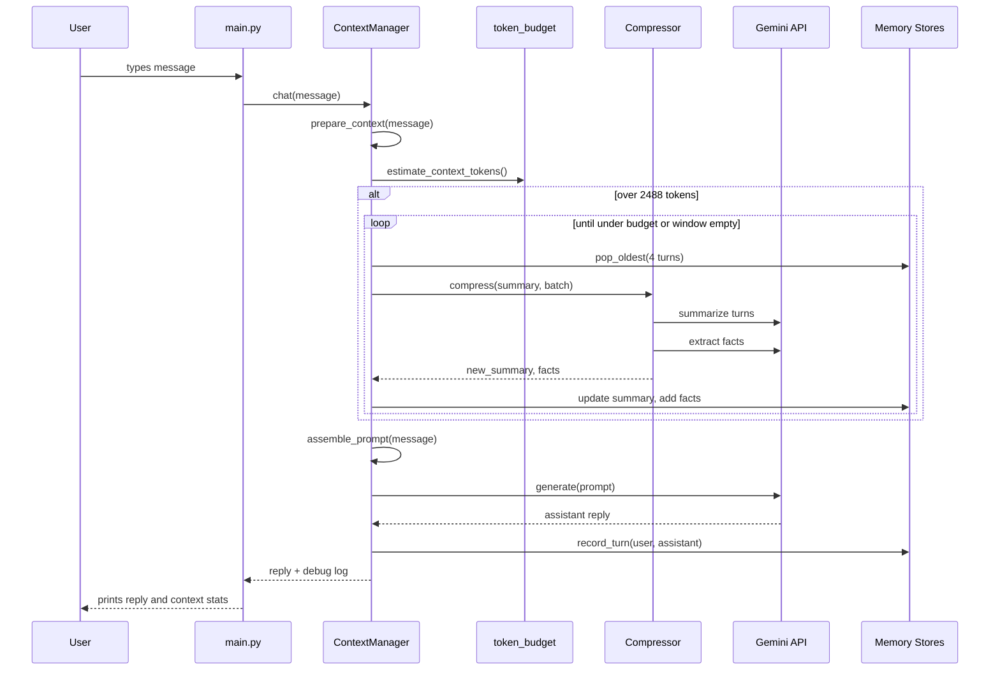

# LLM with Memory — full project walkthrough

## what problem this solves

LLMs have a limited context window. The naive approach is to send the **entire conversation history** on every API call. That works for a few turns, then it breaks down:

- **Cost** — you pay for more input tokens every turn, and it grows linearly
- **Latency** — bigger payloads take longer
- **Coherence** — models get worse when buried in huge logs of old messages

This project is a **memory + context management module** that sits between your app and Gemini. It does **not** build a chat UI — just a terminal script (`main.py`) where you type messages turn by turn. What matters is: **each turn, the module decides exactly what context gets sent to the model.**

---

## high-level idea

Instead of one big blob of history, we use **three tiers of memory**:

| tier | what it holds | format |
|------|---------------|--------|
| **Pinned facts** | durable details (names, dates, prefs, decisions) | bullet list |
| **Running summary** | older conversation compressed into a paragraph | prose |
| **Active window** | recent turns kept verbatim | raw user/assistant pairs |

Every turn, we assemble a prompt in this order:

```
system instructions
→ pinned facts
→ conversation summary
→ recent conversation (window)
→ current user message
```

When the estimated token count gets too high, we **compress** the oldest turns: summarize them, extract facts to pin, and **drop the raw messages** from the window.

---

## project structure

```
.
├── main.py                 # terminal REPL — you type, it calls the API
├── config.py               # thresholds, model name, system prompt
├── requirements.txt        # google-generativeai, python-dotenv
├── .env.example            # template for API key
│
├── memory/
│   ├── manager.py          # orchestrator — compress, assemble, chat
│   ├── stores.py           # ActiveWindow, RunningSummary, PinnedFactsStore
│   ├── compressor.py       # Gemini calls for summarize + fact extraction
│   ├── token_budget.py     # token estimation and budget checks
│   └── types.py            # Turn dataclass (user + assistant + timestamp)
│
├── providers/
│   └── gemini.py           # thin wrapper around Gemini API
│
└── logs/
    └── run_*.log           # full debug output per session
```

---

## the three memory stores

### 1. Active window (`ActiveWindow`)

A Python list of `Turn` objects. Each turn is:

```
User: <what the user said>
Assistant: <what the model replied>
```

New turns get **appended** after each successful API call. When compression runs, the **oldest** turns get `pop_oldest(n)` — removed from the list entirely.

The window has no hard cap in code. It grows until the token budget forces compression.

### 2. Running summary (`RunningSummary`)

A single string that holds a compressed narrative of all turns that have been aged out of the window.

When compression happens, Gemini receives:
- the **existing summary** (may be empty on first compress)
- the **batch of turns** being dropped

It returns one updated summary paragraph that **replaces** the old one entirely.

### 3. Pinned facts (`PinnedFactsStore`)

A list of short fact strings, e.g.:

```
- Trip dates: October 12–22 (Tokyo to Osaka).
- Budget: $2,500 (excluding flights).
```

Facts are extracted by Gemini during compression. The store:
- dedupes case-insensitively
- caps at 20 facts (`MAX_PINNED_FACTS`)
- never removes facts during a session — only adds

---

## token budget — how we decide when to compress

### the numbers (`config.py`)

```python
MAX_CONTEXT_TOKENS = 3000   # max input we'll try to send
RESERVE_FOR_REPLY = 512     # headroom for model output
COMPRESS_BATCH_SIZE = 4     # turns to compress per pass
```

**Available budget** = `3000 - 512` = **2488 tokens**

### estimation

We don't call a tokenizer. We use a rough heuristic:

```python
tokens ≈ len(text) // 4
```

Fast, provider-agnostic, good enough to trigger compression at the right time.

### what gets counted

Before each turn's API call, we estimate tokens for the **full prompt** that would be sent:

```
system instructions
+ pinned facts section
+ summary section
+ active window (all recent turns)
+ current user message
```

If `total > 2488` → compression runs **before** the chat API call.

### why 3000?

Low enough that compression fires during a 15–20 turn demo (around turn 6–10 in our real run). High enough to keep recent dialogue coherent.

---

## execution flow — one turn, step by step

Here's what happens when you type a message and hit enter.



### step 1 — user input

`main.py` reads your message and calls `mgr.chat(msg)`.

### step 2 — prepare context (before API call)

`ContextManager.prepare_context()`:
1. increments turn counter
2. calls `_maybe_compress(current_message)` — **the current message is NOT in the window yet**

### step 3 — compression loop (`_maybe_compress`)

```python
while True:
    total = estimate_context_tokens(pinned, summary, window, current_message, system)
    if total <= 2488:
        break   # under budget, done

    if window is empty:
        break   # nothing left to compress

    batch = window.pop_oldest(4)   # remove oldest 4 turns from memory

    new_summary, facts = compressor.compress(old_summary, batch)
    summary.update(new_summary)
    pinned.add_facts(facts)

    # loop back — re-estimate. may need multiple passes.
```

### step 4 — what `compressor.compress()` does

Two **separate** Gemini API calls on the batch of removed turns:

**Call A — summarize:**
```
System: "Merge these turns into a short running summary..."
User:   "Existing summary: ...\n\nNew turns:\nUser: ...\nAssistant: ..."
```
Returns updated summary text.

**Call B — extract facts:**
```
System: "Pull out facts worth remembering long-term..."
User:   "User: ...\nAssistant: ..."  (the 4 turns)
```
Returns lines like `Budget: $2500` or `NONE`.

### step 5 — assemble prompt

Build the string that actually goes to Gemini:

```python
parts = [
    SYSTEM_INSTRUCTIONS,
    pinned.to_section(),      # "## Pinned Facts\n- fact1\n- fact2"
    summary.to_section(),     # "## Conversation Summary\n..."
    f"## Recent Conversation\n{window.to_text()}",
    f"## Current Message\nUser: {current_message}",
]
prompt = "\n\n".join(parts)
```

### step 6 — chat API call

`provider.generate(prompt)` — this is the **user-facing** reply.

### step 7 — record the turn

After the reply comes back:

```python
window.add(Turn(user=message, assistant=response))
```

The new exchange joins the window for future turns.

---

## compression example from our real run

**Turn 6** — first time compression fired:

```
over budget (2974 > 2488), compressing 4 turns
summary: 0 -> 294 tokens (est)
pinned 4 new facts:
  - Trip dates: October 12–22 (Tokyo to Osaka).
  - Budget: $2,500 (excluding flights).
  - Interests: Ramen and temples.
  - Preferences: Dislikes crowded bars...
dropped 4 raw turns, 1 left in window
context: total~1052 tok (naive full-history would be ~3492)
```

Before compression: ~2974 estimated tokens, all 5 prior turns in the window raw.

After compression:
- 4 turns gone from window (verbatim text deleted)
- their content folded into summary + pins
- only 1 turn left raw in window
- total dropped to ~1052 tokens

Compression also fired on turns **10, 14, and 17** in the same 18-turn session.

---

## naive vs managed

| | naive (send everything) | this module |
|---|---|---|
| tokens at turn 20 | ~3000+ | ~1500–1700 |
| growth per turn | linear O(n) | flattens after compress |
| old turn detail | fully preserved | summarized, some loss |
| API calls per turn | 1 | 1 normally, 3+ when compressing |

**Tradeoff:** we sacrifice verbatim fidelity of old turns for bounded context size. Summary keeps narrative flow; pins keep hard facts. Good enough for long chats; not perfect (see weak point below).

---

## what gets preserved vs lost

| content | preserved as | eventually lost? |
|---------|-------------|------------------|
| names, dates, prefs | pinned facts | no (session lifetime) |
| narrative / decisions | running summary | detail softens on re-summarize |
| exact user/assistant wording | nowhere after drop | yes |
| recent turns | active window (verbatim) | until next compression |

---

## known weak point (from our run)

At **turn 8** the user said: *"2 nights nara for the deer park"*

After compression at **turn 14**, the pinned route became:

```
Tokyo → Kyoto → Nara (Oct 19) → Osaka
```

Nara collapsed from a **2-night stay** into a **single transit day**. The fact extractor captured route shape but dropped the night count. The summary rewrite merged Nara into a day-trip.

Meanwhile **Yuki** (mentioned at turn 17) survived fine — still in the recent window, never compressed.

**Lesson:** early details that only exist in compressed turns are the leakiest. Pins help but extraction isn't reliable enough to catch everything.

---

## configuration reference

| setting | value | purpose |
|---------|-------|---------|
| `MAX_CONTEXT_TOKENS` | 3000 | input budget ceiling |
| `RESERVE_FOR_REPLY` | 512 | space left for model output |
| `COMPRESS_BATCH_SIZE` | 4 | turns removed per compression pass |
| `MAX_PINNED_FACTS` | 20 | cap on pinned fact list |
| `GEMINI_MODEL` | gemini-3.1-flash-lite | primary model |
| `GEMINI_FALLBACK_MODEL` | gemini-3.1-flash-lite-preview | fallback on error |

---

## how to run

```bash
python3 -m venv .venv
source .venv/bin/activate
pip install -r requirements.txt
cp .env.example .env
# add GEMINI_API_KEY to .env

python main.py
```

Commands:
- `/stats` — show pinned facts, summary preview, window size
- `/quit` — exit

Every turn prints a debug log (compression events, token counts, full prompt preview). Also written to `logs/run_<timestamp>.log`.

---

## API calls per turn — summary

| situation | Gemini calls |
|-----------|-------------|
| under budget | 1 (chat reply only) |
| one compression pass | 3 (summarize + extract facts + chat reply) |
| still over after first pass | 5+ (multiple compress loops, then chat) |

Compression is the expensive part. That's the cost of keeping context bounded.

---

## file responsibilities (quick reference)

| file | job |
|------|-----|
| `main.py` | REPL loop, logging to file |
| `memory/manager.py` | brain — compress, assemble, chat, record |
| `memory/stores.py` | data structures for window, summary, pins |
| `memory/compressor.py` | Gemini prompts for summarize + fact extract |
| `memory/token_budget.py` | `len(text)//4` estimation, budget check |
| `memory/types.py` | `Turn` dataclass |
| `providers/gemini.py` | API key loading, `generate()` wrapper |
| `config.py` | all tunables |

---

## what this is NOT

- Not a chat UI or product wrapper
- Not retrieval/RAG over a vector DB
- Not persistent across sessions (everything is in-memory)
- Not using a real tokenizer (estimation is approximate)

It's a deliberate, minimal architecture for the problem: **decide what context the model sees each turn.**
