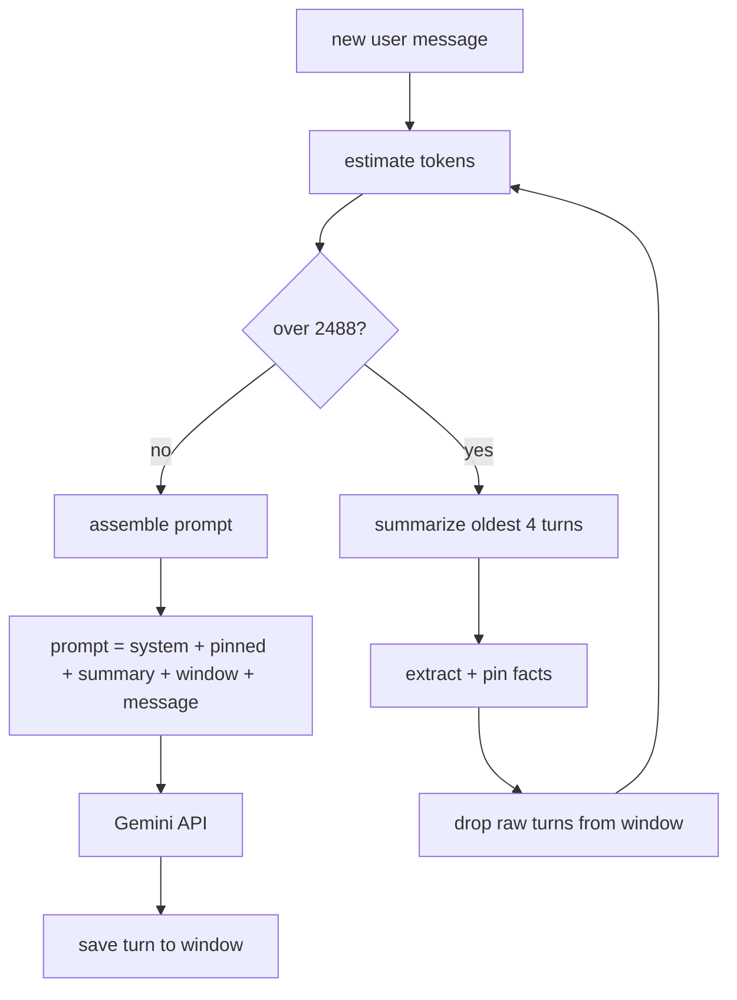

# LLM with Memory

Context management for long Gemini chats. Instead of sending the full history every turn, this keeps pinned facts + a running summary + recent messages.

## setup

```bash
python3 -m venv .venv
source .venv/bin/activate
pip install -r requirements.txt
cp .env.example .env
```

Add your key to `.env`:
```
GEMINI_API_KEY=your_key
```

## run

```bash
python main.py
```

`/stats` to see memory state, `/quit` to exit. Logs saved to `logs/`.

## how it works

Three stores:
- **pinned facts** — names, dates, prefs extracted from old turns
- **summary** — compressed older chat
- **window** — recent turns kept verbatim

Prompt order: system → pinned → summary → recent → current message.

When token estimate crosses 2488 (3000 max minus 512 reserved for reply), oldest 4 turns get summarized and dropped. Facts worth keeping get pinned.



| approach | tokens at turn 20 | growth |
|---|---|---|
| send full history | ~3000 | linear |
| this | ~1500-1700 | flat after compress |

## log excerpt

turn 6 from `logs/run_20260708_093533.log`:

```
--- turn 6 ---
over budget (2974 > 2488), compressing 4 turns
summary: 0 -> 294 tokens (est)
pinned 4 new facts: ['Trip dates: October 12–22 (Tokyo to Osaka).', 'Budget: $2,500 (excluding flights).', ...]
dropped 4 raw turns, 1 left in window
context: 4 facts, summary~294, window=1 turns, total~1052 tok (naive full-history would be ~3492)
```

Also compressed on turns 10, 14, 17. Full run log in `logs/`.

## written explanation

I built a tiered memory layer that sits between the app and Gemini. Each turn it assembles: system prompt → pinned facts → running summary → recent raw turns → the new message. Three stores handle this: a **pinned facts** list (names, dates, prefs), a **running summary** (compressed older chat), and an **active window** (recent turns kept verbatim until compression).

```
[user message] → token check → over budget? → summarize oldest 4 turns → pin facts → drop raw
                                                      ↓
                              [pinned] + [summary] + [window] + [current] → Gemini
```

**Trigger:** compression runs when estimated input tokens exceed 2488 (3000 max context minus 512 reserved for the reply). I used char-length ÷ 4 for estimation — rough but fast. 3000 felt right for a demo: compression actually fires around turn 6–10 without needing 50+ messages. When triggered, the oldest 4 turns get summarized via Gemini, facts extracted into the pin list, and raw messages removed.

**Preserved long-term:** pinned facts and the summary narrative. **Lost:** exact wording of dropped turns; detail fades on repeated re-summarization. Acceptable because unbounded history kills cost and coherence anyway — the summary keeps the thread, pins keep hard facts.

**Weak point from my run:** at turn 8 I said "2 nights nara for the deer park." After compression at turn 14, the pinned route became `Tokyo → Kyoto → Nara (Oct 19) → Osaka` — Nara collapsed from a 2-night stay into a single transit day. The fact extractor grabbed route shape but dropped the night count, and the summary rewrite merged Nara into a day-trip stop. Yuki (mentioned turn 17) survived because it was still in the recent window. Early details only in compressed turns are the leakiest — pins help, but extraction isn't perfect.

